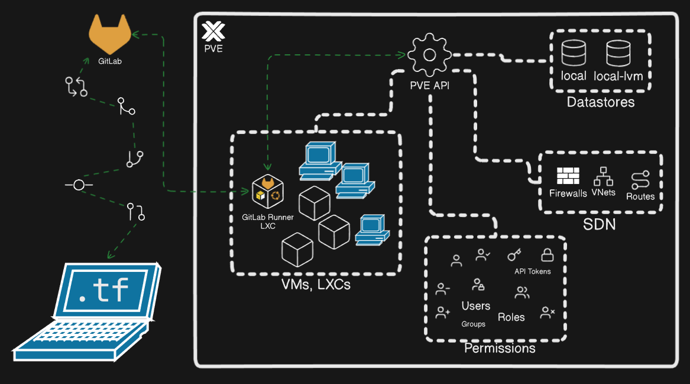

# Managing Proxmox VE via Terraform and GitOps

This program enables a declarative, IaC method of provisioning multiple resources in a Proxmox Virtual Environment.

## Deployment

1. Clone/Fork this Git[Lab](https://gitlab.com/joevizcara/terraform-proxmox.git)/[Hub](https://github.com/joevizcara/terraform-proxmox.git) repository.
2. Go to the **GitLab Project/Repository > Settings > CI/CD > Runner > Create project runner**, mark **Run untagged jobs** and click **Create runner**.
3. On **Step 1**, copy the **runner authentication token**, store it somewhere and click **View runners**.

4. On the PVE Web UI, right-click on the target Proxmox node and click **Shell**.
5. Execute this command in the PVE shell, and follow the prompts.

```bash
bash <(curl -s https://gitlab.com/joevizcara/terraform-proxmox/-/raw/master/prep.sh)
```

> [!CAUTION]
> The content of this shell script can be examined before executing it. It can be executed on a virtualized Proxmox VE to observe what it does. It will create a privileged PAM user to authenticate via an API token. It creates a small LXC environment for GitLab Runner to manage the Proxmox resources. Because of the API [limitations](https://search.opentofu.org/provider/bpg/proxmox/latest/docs/resources/virtual_environment_file#snippets) between the Terraform provider and PVE, it will necessitate to add the SSH public key from the LXC to the **authorized keys** of the PVE node to write the cloud-init configuration YAML files to the local Snippets datastore. It will also add a few more data types that can be accepted in the local datastore (e.g. Snippets, Import). Consider enabling [two-factor authentication](https://docs.gitlab.com/user/profile/account/two_factor_authentication/#enable-two-factor-authentication) on GitLab if this is to be applied on a real environment.

6. Go to **GitLab Project/Repository > Settings > CI/CD > Variables > Add variable**:

**Key**: `PM_API_TOKEN_SECRET` \
**Value**: the token secret value from **credentials.txt**

7. If this repository is cloned locally, adjust the values of the **.tf** files to conform with the PVE onto which this will be deployed.

> [!NOTE]
> The Terraform provider registry is [bpg/proxmox](https://search.opentofu.org/provider/bpg/proxmox/latest) for reference.
> `git push` signals will trigger the GitLab Runner and will apply the infrastructure changes.

8. If the first job stage succeeded, go to **GitLab Project/Repository > Build > Jobs** and click **Run** ▶️ button of the **apply infra** job.

9. If the second job stage succeeded, go to the PVE WUI to start the new VMs to test or configure.

> [!NOTE]
> To configure the VMs, go to PVE WUI and right-click the **gitlab-runner** LXC and click **Console**.
> The GitLab Runner LXC credentials are in the **credentials.txt**.
> Inside the **console**, do `ssh k3s@<ip-address-of-the-VM>`.
> They can be converted into **Templates**, converted into an HA cluster, etc.
> The IP addresses are declared in **variables.tf**.

# Diagramme


